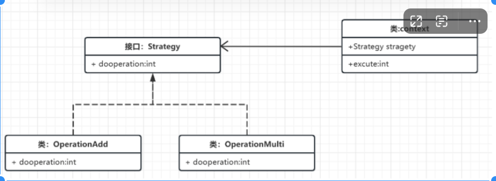

# 设计模式最佳实践

## 1.常见设计模式基本实现
### 1.1.创建者类型(更加关注对象的创建，并对外隐藏创建逻辑)

### 1.2.结构型(关注类和对象的组合)

### 1.3.行为型(更加关注对象之间的通信)
#### 策略模式
适用场景：
- 存在多种算法变体，想要运行期间动态选择相应算法。同时拓展算法时更加灵活不需修改已有代码
- 多重if判断
- 运行时动态改变对象行为
通常包括三类成员：
- 上下文类
- 策略接口
- 策略实现类
通常的实现步骤：
<1> 定义策略接口
<2> 定义接口实现
<3> 定义上下文类，并持有一个策略接口
<4> 根据传入的不同实现使用具体方法

## 2.常见设计模式Spring实现
### 2.1.创建者类型(更加关注对象的创建，并对外隐藏创建逻辑)

### 2.2.结构型(关注类和对象的组合)

### 2.3.行为型(更加关注对象之间的通信)

##

